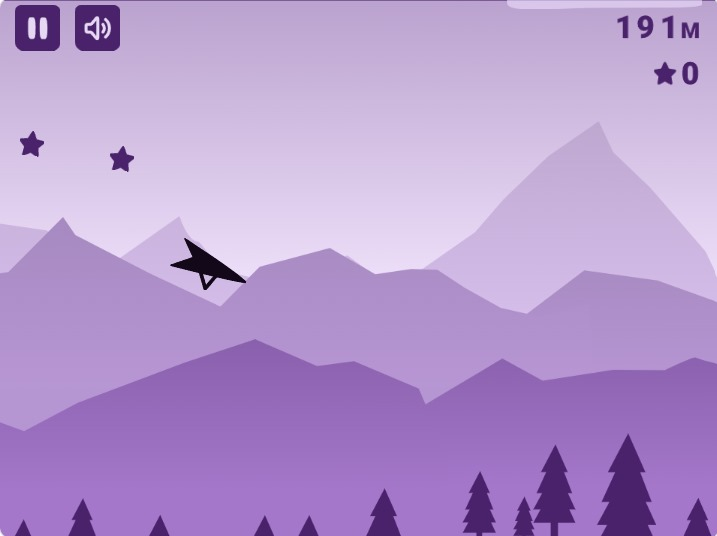
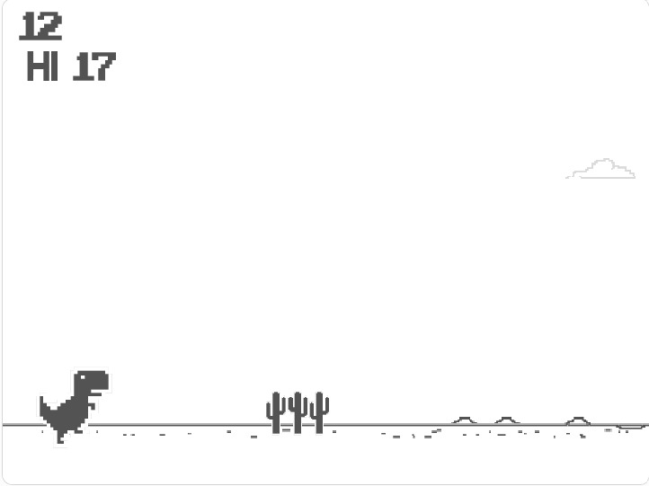
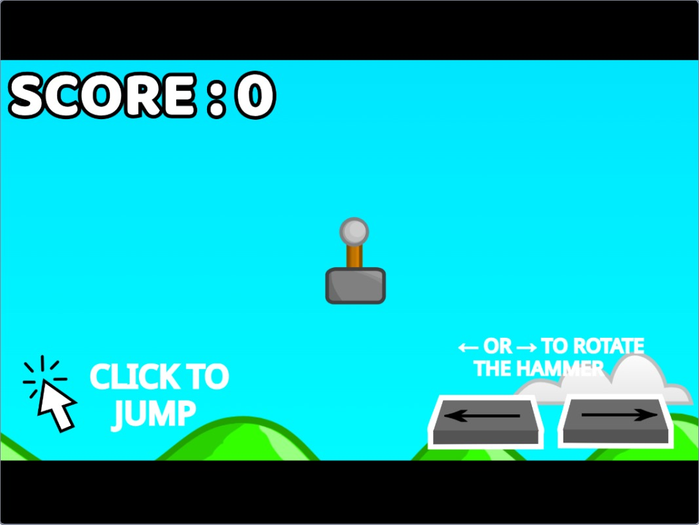

# Voice-Controlled Games ( Google Game Jam )

Welcome to the Voice-Controlled Game Jam! Explore the exciting world of voice-controlled games and challenge your creativity in building innovative gaming experiences.

## Gaming Studio: X Gaming Studio

Visit our Gaming Hub to play and explore a variety of voice-enabled and manual games: <b> X Gaming Studio

## Voice-Enabled Games

### 1. Space Ninja

Engage in epic space battles using only your voice commands to control the ninja ship. Dodge asteroids, defeat enemies, and conquer the galaxy!

### 2. Glider Plane

Soar through breathtaking landscapes in a glider plane adventure, where every voice command directs your flight path. Experience the thrill of aerial maneuvers like never before!

### 3. Slow Ball

Guide a slow-moving ball through intricate mazes and challenges using precise voice controls. Master the art of patience and strategy in this addictive game!

### 4. Chrome Dino

Embark on a dinosaur's journey through the digital wilderness, jumping over obstacles and evading dangers with your voice as the ultimate controller. Can you survive the prehistoric challenges?

### 5. Hammer Jump

Take on the role of a daring adventurer armed with a magical hammer. Swing, jump, and navigate treacherous terrains using intuitive voice commands in this thrilling platformer!

### 6. Parkour Pursuit

Run, jump, and climb through urban landscapes in a high-octane parkour adventure. Your voice controls every move as you strive for speed and precision in this adrenaline-pumping game!

## Manual Games

### 7. Snake Game

Experience the classic Snake game with a voice-controlled twist! Navigate the snake to collect food and grow longer, all through seamless voice commands.

### 8. Build the Stack

Test your reflexes and stacking skills in this addictive game. Use voice prompts to drop blocks and build the highest tower possible without toppling over!

## Tips for Participants

- **Microphone Setup:** Ensure your microphone is correctly configured and positioned for optimal voice recognition.
- **Voice Variation:** Experiment with different tones and volumes to find the most responsive voice commands.
- **Creativity Matters:** Explore new ideas and mechanics to create engaging voice-controlled gameplay experiences.
- **Have Fun:** Enjoy the process of game development and let your creativity shine through your games!

Feel free to modify, enhance, or share these games as per the guidelines provided in each game's repository. Happy coding, and may the best voice-controlled game win!

## Team X Gaming Studio

- Rohan Vinkare
- Abhishek Sahay
- Mamatha Mude
- Prajwal Kumar
- Sujal Awargand
